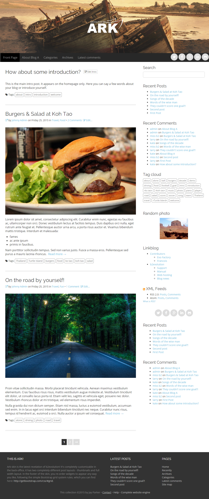
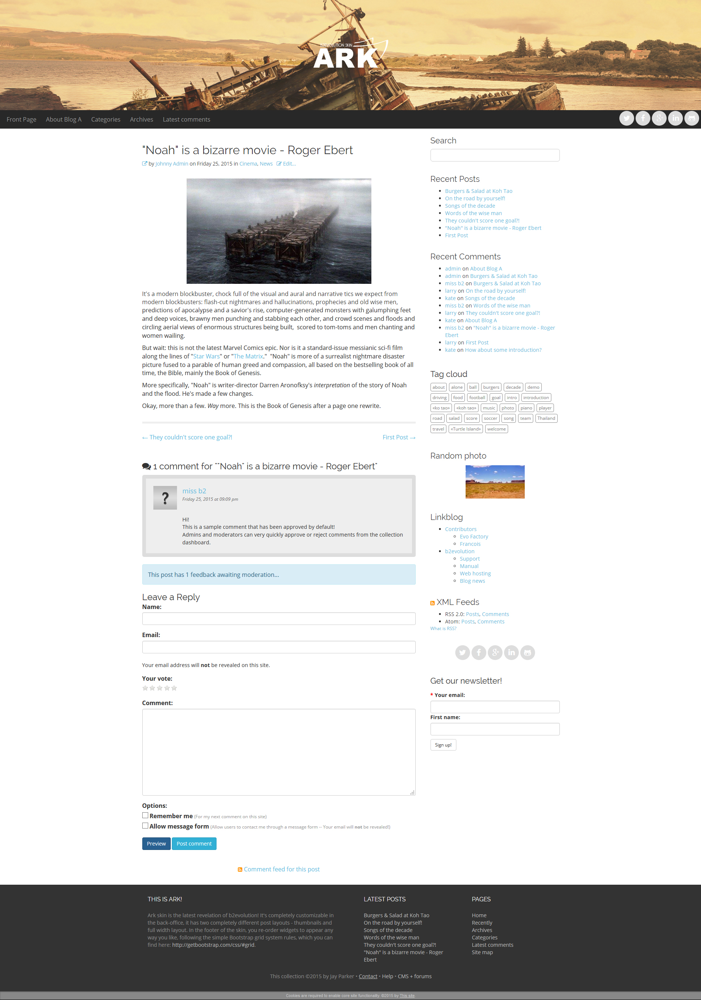
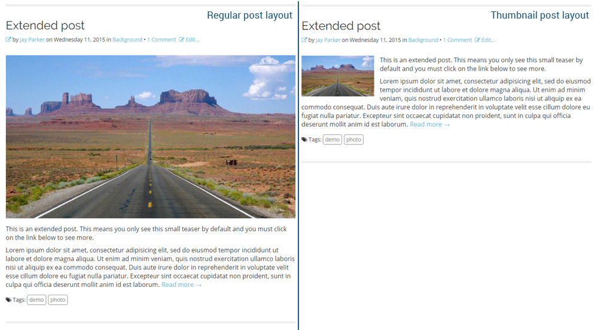

# Ark Skin for b2evolution CMS Blog v6
<a href="http://b2evolution.net/" title="www.b2evolution.net">B2evolution</a> team presents you the latest skin/theme made especially for <a href="http://b2evolution.net/man/about-different-collection-types" title="b2evolution Collections Explanation">Blog Collection</a>.  
 
Link to skin: <a href="http://skins.b2evolution.net/ark-skin" title="Ark skin">http://skins.b2evolution.net/ark-skin</a>. 
Developed by b2evo team in association with <a href="http://mainflowru.com/" title="www.mainflow.ru">mainflowru</a>. 
Current (stable) version: 1.0

---
<h3>Posts display</h4>

<h3>Single post display</h4>

###Main new features of the skin:

- Chose from one of the three sidebar layouts: left sidebar, right sidebar or no sidebar;

- Ark has completely configurable back-office color settings for every element of the skin;

- There are two different post layouts: <strong>Regular</strong> and <strong>Thumbnail</strong>:

- Responsive menu at it's finest! Ark allows you to decide from which point you want to break the regular menu layout to "Hamburger menu" by inserting the exact width (in pixels):

